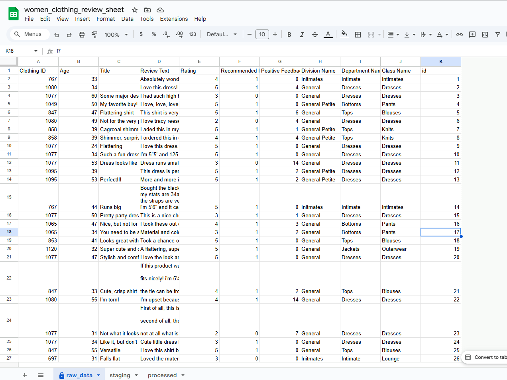
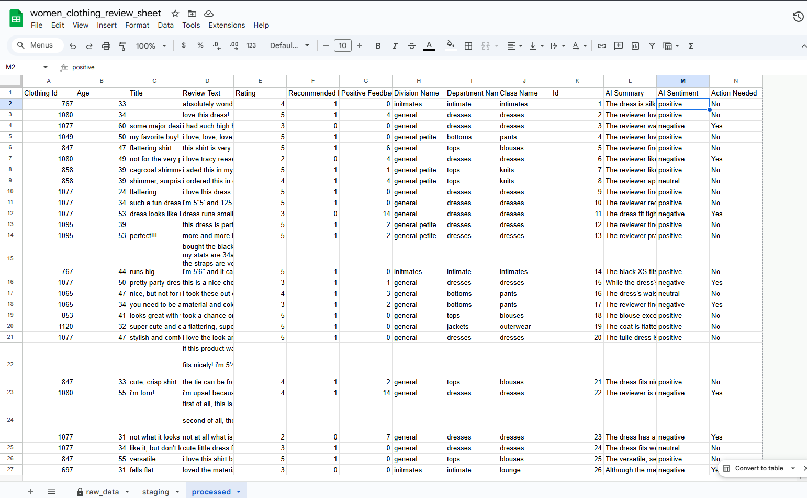
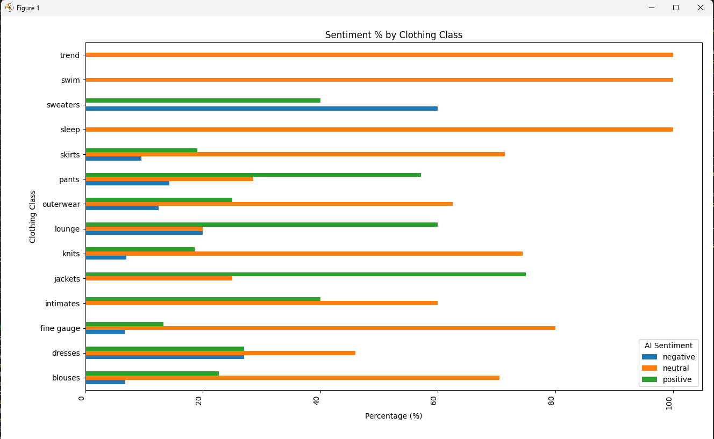

# Automated Review Analysis Using Python, GSpread & Groq LLM

# Introduction
The goal of this assignment is to build an automated review-analysis pipeline using:

* **Python**
* **Google Sheets (via GSpread)**
* **Groq LLM (model: `openai/gpt-oss-20b`)**

The process is capable of : 

* Cleaning and staging raw data
* Integrating an LLM to classify sentiment and summarize reviews
* Writing processed results back into Google Sheets
* Performing analytical insights and generating actionable findings
* Ensuring the pipeline is fully **idempotent**

This project implements a simple, reliable, and extensible data pipeline
built on a **seven-layer architecture**:


    IMPORT_RAW_DATA → RAW_DATA_WS → CLEAN_RAW_DATA_WS → STAGING_WS →  AI_REVIEW → PROCESSED_WS → ANALYSIS 

The pipeline ingests review data from a csv file, loads it into the Raw Data worksheet, applies column name standardization, then loads the data into the Staging worksheet. From there, the reviews are sent to Groq AI for summarization and sentiment classification before being stored in the Processed worksheet and used to generate analysis.

# Dataset Overview

This dataset contains customer reviews along with multiple metadata fields. Review text has been anonymized; brand replaced with **"retailer"** for data privacy. The dataset includes 23,486 rows and 10 feature variables. Only the **first 200 rows** will be used for this project. Each row corresponds to a customer review, and includes the variables:

* Clothing ID: Integer Categorical variable that refers to the specific piece being reviewed.

* Age: Positive Integer variable of the reviewers age.

* Title: String variable for the title of the review.

* Review Text: String variable for the review body.

* Rating: Positive Ordinal Integer variable for the product score granted by the customer from 1 Worst, to 5 Best.

* Recommended IND: Binary variable stating where the customer recommends the product where 1 is recommended, 0 is not recommended.

------------------------------------------------------------------------

# Project Structure


```
automated_review_analysis/
│
├── configs/
│   ├── __init__.py
│   ├── .end (not part of submission)
│   ├── config.py
│   └── credentials.json (not part of submission)
├── data/
│   ├── Womens Clothing E-Commerce Reviews.csv
├── src/
│   ├── __init__.py
│   ├── utils.py
│   ├── etl.py
│   └── analysis.py
│
├── tests/
│   ├── __init__.py
│   ├── test_analysis.py
│   ├── test_etl.py
│   └── test_utils.py
│
├── README.md
├── requirements.txt
└── pytest.ini (not part of submission)
```
 
# Module	Responsibility

* config/ – Configuration & Credentials. It contains all project-level configuration files
* src/ – Main Source Code. This folder contains all Python modules that power the entire pipeline.
    *  utils.py	- Implements GsheetAIAuto class, which handles: reading CSV, cleaning sheets, uploading data, transforming columns, calling Groq AI, adding sentiment labels, ensuring idempotency.
    * etl.py - Central entry point for the pipeline. it is used for pipeline integration  
    * analysis.py -	Performs analytics such as sentiment counts, class distribution, summary metrics, and produces visualizations.

* tests/ – it contains the code for unit Tests
    * Ensures every functions in the src folder works perfectly.
    * Ensures that pipeline integration works perfectly.
    * Verifies idempotency, column transformations, worksheet interactions (mocked), and AI summarization logic.
* data/ – Input csv data - This folder holds datasets and any local files used by the pipeline.

------------------------------------------------------------------------

## End-to-End Pipeline Flow

1.  **Load & Upload Raw Data**
    -   Reads CSV from local storage.
    -   Does a partial upload to the RAW_DATA sheet, by appending only non existing records to the sheet.
    -   The RAW_DATA sheet is protected, hence it is not cleared for new records to come in.
2.  **Transform & Clean Into Staging**
    -   The data uploaded to the RAW_DATA WS is puuled and cleaned then uploaded to the STAGING wS
    -   Rows are also validated to avoid dupliacates.
3.  **Groq AI Enrichment**
    - cleaned data on the STAGING WS, is passed to the Groq AI model in batches.
    -   Batch processes reviews  is done to extracts:
        -  AI Summary
        -  AI Sentiment
    -   Handles:
        -   Empty inputs and nan
        -   Result are mapped to the dataframe for their respective review.
4.  **Analysis**
    -   Processed data is sent to the analysis module for a summary analysis.

------------------------------------------------------------------------


## Before/After Screenshots
 
# Raw Data sheet (before pipeline)




# Processed sheet (after pipeline)


------------------------------------------------------------------------

## Demo

* Before you run, install necessary dependencies in the requirements.txt and ensure your `.env` contain:
```

    GROQ_API_KEY=GROQ_API_KEY_HERE
    CREDS_PATH=./configs/credentials.json
    SHEET_ID= YOUR_GOOGLE_SHEET_ID
    CSV_PATH=Womens Clothing E-Commerce Reviews.csv
```
```
(sheet_venv) PS C:\Users\Personal\data_epic\week_7\automated_review_analysis> python src/etl.py
INFO - ...starting the pipeline - 2025-11-24 04:42:00,198
INFO - creating GSheet client - 2025-11-24 04:42:00,205
INFO - ...getting spreeadsheet with id 1FmN-X7sUya8sSGpAFVJcML_pMx4LHcGOGzJrl7DvK1U - 2025-11-24 04:42:00,205
INFO - ..importing dataset - 2025-11-24 04:42:02,454
INFO - Getting worksheet raw_data - 2025-11-24 04:42:02,605
INFO - raw_data worksheet found - 2025-11-24 04:42:02,966
INFO - Removing unnessary worksheet in the spreadsheet - 2025-11-24 04:42:03,375
INFO - Uploading data to <Worksheet 'raw_data' id:303906945> worksheet - 2025-11-24 04:42:03,785
INFO - 4 number of records already exists - 2025-11-24 04:42:04,128
INFO - Adding 196 new records - 2025-11-24 04:42:04,128
INFO - Records uploaded successfully to 'raw_data'! - 2025-11-24 04:42:04,912
INFO - Getting worksheet staging - 2025-11-24 04:42:04,913
INFO - staging worksheet found - 2025-11-24 04:42:05,237
INFO - Pulling data from <Worksheet 'raw_data' id:303906945> worksheet - 2025-11-24 04:42:05,627
INFO - Processing the staging data - 2025-11-24 04:42:06,086
INFO - Standardizing the data column names - 2025-11-24 04:42:06,087
INFO - Normalizing the review text - 2025-11-24 04:42:06,087
INFO - Uploading data to <Worksheet 'staging' id:131853604> worksheet - 2025-11-24 04:42:06,107
INFO - 4 number of records already exists - 2025-11-24 04:42:06,447
INFO - Adding 196 new records - 2025-11-24 04:42:06,447
INFO - Records uploaded successfully to 'staging'! - 2025-11-24 04:42:07,581
INFO - Getting worksheet processed - 2025-11-24 04:42:07,581
INFO - processed worksheet found - 2025-11-24 04:42:07,893
INFO - Pulling data from <Worksheet 'processed' id:1319354466> worksheet - 2025-11-24 04:42:08,597
>> 200
>> 4
INFO - Pulling data from <Worksheet 'staging' id:131853604> worksheet - 2025-11-24 04:42:09,009
INFO - Using Groq AI - 2025-11-24 04:42:09,426
INFO - HTTP Request: POST https://api.groq.com/openai/v1/chat/completions "HTTP/1.1 200 OK" - 2025-11-24 04:42:12,899
INFO - HTTP Request: POST https://api.groq.com/openai/v1/chat/completions "HTTP/1.1 200 OK" - 2025-11-24 04:42:20,681
INFO - HTTP Request: POST https://api.groq.com/openai/v1/chat/completions "HTTP/1.1 200 OK" - 2025-11-24 04:42:28,668
INFO - HTTP Request: POST https://api.groq.com/openai/v1/chat/completions "HTTP/1.1 200 OK" - 2025-11-24 04:42:36,450
INFO - HTTP Request: POST https://api.groq.com/openai/v1/chat/completions "HTTP/1.1 200 OK" - 2025-11-24 04:42:44,335
INFO - HTTP Request: POST https://api.groq.com/openai/v1/chat/completions "HTTP/1.1 200 OK" - 2025-11-24 04:42:52,424
INFO - HTTP Request: POST https://api.groq.com/openai/v1/chat/completions "HTTP/1.1 200 OK" - 2025-11-24 04:43:00,413
INFO - HTTP Request: POST https://api.groq.com/openai/v1/chat/completions "HTTP/1.1 200 OK" - 2025-11-24 04:43:08,398
INFO - HTTP Request: POST https://api.groq.com/openai/v1/chat/completions "HTTP/1.1 429 Too Many Requests" - 2025-11-24 04:43:14,029
INFO - Retrying request to /openai/v1/chat/completions in 1.000000 seconds - 2025-11-24 04:43:14,030
INFO - HTTP Request: POST https://api.groq.com/openai/v1/chat/completions "HTTP/1.1 200 OK" - 2025-11-24 04:43:17,625
INFO - HTTP Request: POST https://api.groq.com/openai/v1/chat/completions "HTTP/1.1 429 Too Many Requests" - 2025-11-24 04:43:23,246
INFO - Retrying request to /openai/v1/chat/completions in 1.000000 seconds - 2025-11-24 04:43:23,247
INFO - HTTP Request: POST https://api.groq.com/openai/v1/chat/completions "HTTP/1.1 200 OK" - 2025-11-24 04:43:26,215
INFO - HTTP Request: POST https://api.groq.com/openai/v1/chat/completions "HTTP/1.1 200 OK" - 2025-11-24 04:43:34,204
INFO - HTTP Request: POST https://api.groq.com/openai/v1/chat/completions "HTTP/1.1 429 Too Many Requests" - 2025-11-24 04:43:39,834
INFO - Retrying request to /openai/v1/chat/completions in 2.000000 seconds - 2025-11-24 04:43:39,835
INFO - HTTP Request: POST https://api.groq.com/openai/v1/chat/completions "HTTP/1.1 200 OK" - 2025-11-24 04:43:44,250
INFO - HTTP Request: POST https://api.groq.com/openai/v1/chat/completions "HTTP/1.1 429 Too Many Requests" - 2025-11-24 04:43:49,973
INFO - Retrying request to /openai/v1/chat/completions in 1.000000 seconds - 2025-11-24 04:43:49,974
INFO - HTTP Request: POST https://api.groq.com/openai/v1/chat/completions "HTTP/1.1 200 OK" - 2025-11-24 04:43:53,454
INFO - HTTP Request: POST https://api.groq.com/openai/v1/chat/completions "HTTP/1.1 429 Too Many Requests" - 2025-11-24 04:43:59,290
INFO - Retrying request to /openai/v1/chat/completions in 3.000000 seconds - 2025-11-24 04:43:59,291
INFO - HTTP Request: POST https://api.groq.com/openai/v1/chat/completions "HTTP/1.1 200 OK" - 2025-11-24 04:44:04,513
INFO - HTTP Request: POST https://api.groq.com/openai/v1/chat/completions "HTTP/1.1 429 Too Many Requests" - 2025-11-24 04:44:10,080
INFO - Retrying request to /openai/v1/chat/completions in 1.000000 seconds - 2025-11-24 04:44:10,081
INFO - HTTP Request: POST https://api.groq.com/openai/v1/chat/completions "HTTP/1.1 200 OK" - 2025-11-24 04:44:13,490
INFO - HTTP Request: POST https://api.groq.com/openai/v1/chat/completions "HTTP/1.1 429 Too Many Requests" - 2025-11-24 04:44:19,156
INFO - Retrying request to /openai/v1/chat/completions in 1.000000 seconds - 2025-11-24 04:44:19,157
INFO - HTTP Request: POST https://api.groq.com/openai/v1/chat/completions "HTTP/1.1 200 OK" - 2025-11-24 04:44:22,739
INFO - HTTP Request: POST https://api.groq.com/openai/v1/chat/completions "HTTP/1.1 429 Too Many Requests" - 2025-11-24 04:44:28,372
INFO - Retrying request to /openai/v1/chat/completions in 2.000000 seconds - 2025-11-24 04:44:28,373
INFO - HTTP Request: POST https://api.groq.com/openai/v1/chat/completions "HTTP/1.1 200 OK" - 2025-11-24 04:44:32,873
INFO - HTTP Request: POST https://api.groq.com/openai/v1/chat/completions "HTTP/1.1 429 Too Many Requests" - 2025-11-24 04:44:38,509
INFO - Retrying request to /openai/v1/chat/completions in 2.000000 seconds - 2025-11-24 04:44:38,510
INFO - HTTP Request: POST https://api.groq.com/openai/v1/chat/completions "HTTP/1.1 200 OK" - 2025-11-24 04:44:43,015
INFO - HTTP Request: POST https://api.groq.com/openai/v1/chat/completions "HTTP/1.1 429 Too Many Requests" - 2025-11-24 04:44:48,646
INFO - Retrying request to /openai/v1/chat/completions in 2.000000 seconds - 2025-11-24 04:44:48,647
INFO - HTTP Request: POST https://api.groq.com/openai/v1/chat/completions "HTTP/1.1 200 OK" - 2025-11-24 04:44:53,255
INFO - HTTP Request: POST https://api.groq.com/openai/v1/chat/completions "HTTP/1.1 200 OK" - 2025-11-24 04:45:01,243
INFO - Done getting the AI Summary and AI Sentiments - 2025-11-24 04:45:06,246
INFO - Adding the Action needed? column - 2025-11-24 04:45:06,247
INFO - Added the Action Needed column! - 2025-11-24 04:45:06,263
INFO - Added the Action Needed column! - 2025-11-24 04:45:06,263
INFO - Uploading data to <Worksheet 'processed' id:1319354466> worksheet - 2025-11-24 04:45:06,264
INFO - 4 number of records already exists - 2025-11-24 04:45:06,772
INFO - Adding 196 new records - 2025-11-24 04:45:06,773
INFO - Records uploaded successfully to 'processed'! - 2025-11-24 04:45:08,001
INFO - 4 number of records already exists - 2025-11-24 04:45:06,772
INFO - Adding 196 new records - 2025-11-24 04:45:06,773
INFO - Records uploaded successfully to 'processed'! - 2025-11-24 04:45:08,001
INFO - Adding 196 new records - 2025-11-24 04:45:06,773
INFO - Records uploaded successfully to 'processed'! - 2025-11-24 04:45:08,001
INFO - Records uploaded successfully to 'processed'! - 2025-11-24 04:45:08,001

=== Sentiment Percentage Breakdown per Clothing Class ===
AI Sentiment  negative  neutral  positive
Class Name
blouses           6.82    70.45     22.73
dresses          27.03    45.95     27.03
fine gauge        6.67    80.00     13.33
intimates         0.00    60.00     40.00
jackets           0.00    25.00     75.00
knits             6.98    74.42     18.60
lounge           20.00    20.00     60.00
outerwear        12.50    62.50     25.00
pants            14.29    28.57     57.14
skirts            9.52    71.43     19.05
sleep             0.00   100.00      0.00
sweaters         60.00     0.00     40.00
swim              0.00   100.00      0.00
trend             0.00   100.00      0.00

=== Highest Sentiment Classes ===
Highest POSITIVE sentiment: jackets (75.00%)
Highest NEGATIVE sentiment: sweaters (60.00%)
Highest NEUTRAL sentiment:  sleep (100.00%)

```


------------------------------------------------------------------------

## Analysis Summary
# Sentiment distribution report + key insights.

 

 # Key insight

* The claas of cloth with the highest POSITIVE sentiment is jackets (75.00%)
* The claas of cloth with the highest NEGATIVE sentiment issweaters (60.00%)
* The claas of cloth with the highest NEUTRAL sentiment is  sleep (100.00%)
* The AI model classified 50 reviews as positive, 25 as negative and the remaining 125 as neutral 
------------------------------------------------------------------------

##  Run Tests With Coverage

   ```
   (sheet_venv) PS C:\Users\Personal\data_epic\week_7\automated_review_analysis> pytest --cov=src       
===================================================================================================================== test session starts =====================================================================================================================
platform win32 -- Python 3.13.6, pytest-9.0.1, pluggy-1.6.0
rootdir: C:\Users\Personal\data_epic\week_7\automated_review_analysis
configfile: pytest.ini
plugins: anyio-4.11.0, cov-7.0.0, dotenv-0.5.2, mock-3.15.1
collected 13 items                                                                                                                                                                                                                                             

tests\test_analysis.py .                                                                                                                                                                                                                                 [  7%]
tests\test_etl.py ..                                                                                                                                                                                                                                     [ 23%]
tests\test_utils.py ..........                                                                                                                                                                                                                           [100%]

======================================================================================================================= tests coverage ======================================================================================================================== 
_______________________________________________________________________________________________________ coverage: platform win32, python 3.13.6-final-0 _______________________________________________________________________________________________________ 

Name              Stmts   Miss  Cover
-------------------------------------
src\__init__.py       0      0   100%
src\analysis.py      24      1    96%
src\etl.py           34      1    97%
src\utils.py        120     21    82%
-------------------------------------
TOTAL               178     23    87%

   ```

------------------------------------------------------------------------

## Lessons 

* Gained practical experience using gspread to interact with and manipulate Google Sheets.
* Learned how to integrate GroqAI for text summarization and sentiment analysis.
* Developed a better understanding of environment variables (.env files) and how to manage configuration securely
* Learned how to use pytest-dotenv to load and test environment variables during testing.
* limitation: having the log as console output, I would like to implement a file-based logging to persist logs beyond console output.

------------------------------------------------------------------------

 


 